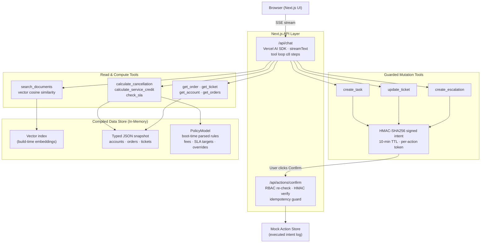

# Architecture

## 1. High-level shape

Single Next.js app; no external database. The data pack is a static snapshot, so compiled JSON
is committed as a build artifact (`src/data/generated/`).

## 2. Data pipeline

1. `scripts/compile_data.py` — extracts PDFs (pypdf) and xlsx (openpyxl) into:
   - `documents.json`: doc registry + section-level chunks with authority metadata
     (`type`, `status`, `authority_tier`, `effective_date`, `applies_to`).
   - `structured.json`: accounts/orders/tickets + `snapshot_time` (the single reference clock,
     2026-08-16 11:00 IST).
2. `scripts/embed.ts` — embeds chunk texts, known-issue summaries, severity definitions and
   ticket texts via the configured provider into `vectors.json` (content-hashed for staleness
   detection). Committed so runtime never pays embedding cost for the corpus.

## 3. PolicyModel — the anti-hardcoding core

`src/lib/policy/registry.ts` builds a validated model at boot by regex-extracting every rule
parameter from the corpus:

| Parameter | Source |
|---|---|
| Cancellation free window (30 min), late fee (₹250) | SOP §1 |
| Credit threshold (2 h), formula min(₹500, 10% fee) | SOP §2 |
| Manager-approval threshold (₹1,000) | SOP §3 |
| Response-target matrix per plan × severity | Policy v3 §3 (plan names sourced from accounts data) |
| Bulk-upload row limit (5,000) | Guide §1 |
| Known-issue registry incl. status/workaround | Guide §2–3 |
| Per-account overrides: SLA targets, fee waiver, fixed credit + threshold, aggregate cap | Each ACTIVE contract |

Missing parameters produce warnings surfaced at `/api/health`; engines throw rather than
default silently. Tests pin every parsed value so a data-pack change fails CI instead of
changing behaviour invisibly.

## 4. Retrieval (pure vector RAG)

- Query is embedded at request time (Gemini `text-embedding-004` primary, Jina fallback
  provider); chunks were embedded at build time. Ranking = cosine only — no lexical scorer.
- Entity IDs (ORD-/TKT-/ACCT-/KI-) intentionally bypass retrieval: structured lookup tools give
  exact records, which is both faster and immune to embedding noise on identifiers.
- If the embedding provider is down or vectors are absent, `search_documents` returns an
  explicit `unavailable` result that the agent reports honestly — no silent degradation to made-up answers.
- Scale note: brute-force cosine over ~40 committed vectors is microseconds. A vector DB
  (pgvector) becomes justified around ~10k+ chunks; the `Retriever` seam makes that swap local.

## 5. Engines

- **Severity inference** — primary signal: cosine between ticket embeddings and embeddings of
  the policy's own severity definitions (built in `npm run embed`). Fallback: n-gram overlap
  against those same definition texts. Both derive from the document; nothing per-ticket is coded.
- **SLA** — target = contract override → policy plan matrix. Business-hours calendar is one
  documented assumption (Mon–Fri 09:00–18:00 IST) because the pack never defines "business
  hours"; non-business-hour (24×7-style) targets count wall-clock minutes.
- **Credit/cancellation** — pure functions `evaluateCancellation(order, terms)` /
  `evaluateServiceCredit(order, terms)`; dataset wrappers resolve entities then delegate.
  Unknown carrier fault hard-stops credit promises (SOP §3) even when the delay threshold passes.

## 6. Actions & confirmation protocol

Guarded tools never mutate. They mint `{intent, token=HMAC(body)}`; the UI renders a Confirm
card; `POST /api/actions/confirm` re-verifies signature + TTL + role (both session role and the
role that created the intent), then executes through the single mutation point
(`executeIntent`) with an idempotency set. This works on ephemeral serverless runtimes with
zero infrastructure. Swapping the mock store for Postgres means implementing the small
interface in `src/lib/actions/store.ts`.

## 7. Security posture

- HMAC-signed httpOnly session cookies (12 h TTL); mock auth clearly labelled.
- RBAC matrix enforced in-tool and re-checked at execution.
- Zod validation on env and tool inputs; bounded agent loops (`stopWhen: stepCountIs(8)`);
  sliding-window rate limit per session; secrets only server-side.

## 8. Trade-offs & known limitations

- **In-memory executed-action log** — resets per cold start; acceptable for a mocked write path,
  interface-ready for persistence.
- **Lexical severity fallback** mis-classifies paraphrased tickets when vectors are missing;
  vector mode (the default once `npm run embed` has run) resolves these semantically.
- **"Business hours"** is an operational assumption, flagged wherever shown.
- **No customer-facing bot yet** — internal-first scope decision (see PRODUCT.md); the persona/
  capability layer is designed to extend to account-scoped customer access.
