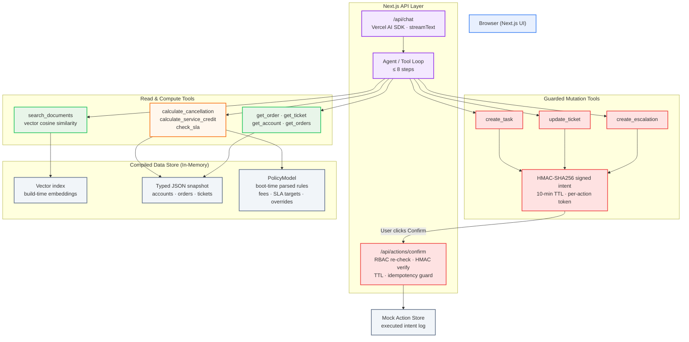

# Architecture

## 1. High-level shape

ParcelPilot is implemented as a single Next.js application. The agent operates through a bounded Vercel AI SDK tool loop, with a clear separation between read/compute capabilities and guarded state-changing actions.



The application has no external database. The supplied data pack is treated as a static snapshot, so compiled JSON and build-time embeddings are committed under `src/data/generated/`.

At runtime, the main execution paths are:

```text
User
  ↓
Next.js UI
  ↓
/api/chat
  ↓
Agent / bounded tool loop
  ├── Retrieval
  ├── Structured lookup
  ├── Deterministic calculation
  └── Guarded mutation preparation
          ↓
      Confirmation
          ↓
/api/actions/confirm
          ↓
 RBAC + HMAC + TTL + idempotency
          ↓
      Mutation
```

The separation is intentional: the model can decide **which capability to use**, but sensitive authorization and business-critical calculations are enforced outside the model.

---

## 2. Request and tool execution model

The chat endpoint uses the Vercel AI SDK `streamText` flow with a bounded tool loop.

The agent can combine multiple tools when a request requires information from different parts of the data pack.

For example:

```text
"Can Northstar cancel ORD-1001 without a cancellation fee?"

User request
    ↓
Agent
    ↓
Identify order
    ↓
get_order
    ↓
Identify applicable customer agreement
    ↓
search_documents
    ↓
Retrieve cancellation rules
    ↓
calculate_cancellation
    ↓
Return explanation
```

A more involved operational request can span several sources:

```text
Order lookup
      +
Customer agreement
      +
Current policy / SOP
      +
SLA calculation
      +
Known issue lookup
      ↓
Agent decision
      ↓
Answer or prepare action
```

The loop is bounded to a maximum of 8 steps using `stopWhen: stepCountIs(8)`.

This prevents an agent from entering an unbounded tool-execution loop while still allowing enough steps for the assessment's multi-source requests.

---

## 3. Data pipeline

The data pack is compiled before runtime rather than parsed from the original PDFs/XLSX files on every request.

### Step 1 — Compile the source data

`scripts/compile_data.py` extracts:

* PDFs using `pypdf`
* XLSX data using `openpyxl`

The output is:

```text
src/data/generated/
├── documents.json
└── structured.json
```

### `documents.json`

Contains the document registry and section-level chunks with authority metadata:

```text
type
status
authority_tier
effective_date
applies_to
```

This metadata allows retrieval and downstream reasoning to distinguish between current policies, deprecated documents, customer agreements, product documentation, and historical/contextual information.

### `structured.json`

Contains:

```text
accounts
orders
tickets
snapshot_time
```

The dataset snapshot time is treated as the single reference clock for time-based questions.

The current compiled snapshot uses:

```text
2026-08-16 11:00 IST
```

### Step 2 — Generate embeddings

`scripts/embed.ts` embeds:

* Document chunks
* Known-issue summaries
* Severity definitions
* Ticket texts

The resulting vector data is stored in:

```text
src/data/generated/vectors.json
```

Embeddings are content-hashed so stale vectors can be detected when source content changes.

Committing the vectors means the runtime does not need to pay the embedding cost for the static corpus during deployment or startup.

---

## 4. PolicyModel — the anti-hardcoding core

`src/lib/policy/registry.ts` builds a validated `PolicyModel` at boot by extracting business-rule parameters from the supplied corpus.

The goal is to keep business behavior data-driven rather than encoding individual policy values directly into application logic.

The current model includes:

| Parameter                                         | Source                    |
| ------------------------------------------------- | ------------------------- |
| Cancellation free window: 30 min                  | SOP §1                    |
| Late cancellation fee: ₹250                       | SOP §1                    |
| Service-credit threshold: 2 h                     | SOP §2                    |
| Service-credit formula: `min(₹500, 10% fee)`      | SOP §2                    |
| Manager-approval threshold: ₹1,000                | SOP §3                    |
| Response-target matrix per plan × severity        | Policy v3 §3              |
| Plan names                                        | Accounts data             |
| Bulk-upload row limit: 5,000                      | Guide §1                  |
| Known-issue registry, including status/workaround | Guide §2–3                |
| Per-account SLA overrides                         | Active customer contracts |
| Per-account fee-waiver overrides                  | Active customer contracts |
| Fixed service-credit + threshold overrides        | Active customer contracts |
| Aggregate credit caps                             | Active customer contracts |

Missing parameters produce warnings surfaced through `/api/health`.

The engines throw rather than silently defaulting when a required business parameter is unavailable.

Tests pin the parsed values so that a change to the data pack can fail CI rather than silently changing application behavior.

This is important for the assessment because the system must reason over the supplied data rather than hard-code answers for the example records.

---

## 5. Retrieval

ParcelPilot uses pure vector retrieval for document search.

### Corpus indexing

Document chunks are embedded at build time.

At request time, the user's search query is embedded using the configured embedding provider.

Ranking uses cosine similarity.

There is no lexical scorer in the primary retrieval path.

```text
Query
  ↓
Embedding provider
  ↓
Query vector
  ↓
Cosine similarity against corpus vectors
  ↓
Ranked document chunks
  ↓
Agent
```

### Entity-aware lookup

Identifiers such as:

```text
ORD-*
TKT-*
ACCT-*
KI-*
```

intentionally bypass semantic retrieval when an exact structured lookup is available.

For example:

```text
"ORD-1001"
```

is better resolved through `get_order` than through semantic search.

This avoids embedding noise on identifiers and gives the agent an exact structured record.

### Retrieval failure behavior

If the embedding provider is unavailable or the vector index is missing, `search_documents` returns an explicit `unavailable` result.

The agent is expected to report that limitation rather than silently degrading into an unsupported answer.

### Scale trade-off

The assessment corpus is small enough that brute-force cosine similarity over approximately 40 committed vectors is sufficient and operates at microsecond-scale latency.

At larger scale, a vector database such as pgvector would become more appropriate.

The `Retriever` interface keeps that migration local to the retrieval layer.

---

## 6. Source authority and conflict handling

The source data is intentionally imperfect.

The system therefore does not treat every retrieved source as equally authoritative.

The effective precedence is:

```text
Customer-specific active agreement
              ↓
Current support policy / applicable SOP
              ↓
Product & operations documentation
              ↓
Historical ticket resolutions
```

### Customer agreements

An active customer agreement can override general policy behavior for that account.

Examples include:

* SLA target overrides
* Fee waivers
* Fixed service-credit rules
* Account-specific credit thresholds
* Aggregate credit caps

### Current vs. deprecated policy

Deprecated policy documents remain available to the retrieval layer as context but do not automatically override current policy.

### Historical tickets

Historical ticket resolutions are treated as context only.

They may contain incorrect or outdated guidance and therefore cannot override authoritative current sources.

### Why this is separate from retrieval

Similarity determines what information is relevant.

It does not determine what information is authoritative.

The architecture therefore separates:

```text
Retrieval relevance
        ↓
Source classification
        ↓
Authority / precedence
        ↓
Business-rule evaluation
```

This avoids treating the highest-scoring retrieved chunk as automatically correct.

---

## 7. Deterministic engines

Business-critical calculations are performed outside the language model.

The model identifies the relevant entities and rules, then delegates calculations to typed TypeScript functions.

### Severity inference

Severity inference uses the policy's own severity definitions as the reference.

Primary signal:

```text
Ticket embedding
      ↓
Cosine similarity
      ↓
Policy severity-definition embeddings
```

Fallback:

```text
Ticket text
      ↓
n-gram overlap
      ↓
Same document-derived severity definitions
```

Nothing is hard-coded on a per-ticket basis.

### SLA

The SLA target is resolved using:

```text
Contract override
      ↓
Policy plan × severity matrix
```

The implementation uses the dataset snapshot time as its reference clock.

Because the supplied pack does not define business hours, the implementation uses the documented assumption:

```text
Monday–Friday
09:00–18:00 IST
```

This assumption is surfaced wherever it affects an SLA result.

Targets that operate on a 24×7-style basis count wall-clock minutes.

### Cancellation

The cancellation engine is exposed as a pure function:

```text
evaluateCancellation(order, terms)
```

The dataset wrapper resolves the relevant entities and delegates to the engine.

### Service credit

The service-credit engine is exposed as:

```text
evaluateServiceCredit(order, terms)
```

The engine applies the applicable threshold, fee, contract override, and credit cap rules.

Unknown carrier fault is treated as a hard stop for credit promises under SOP §3, even when the delay threshold itself has been reached.

This prevents the system from converting an incomplete causal record into an unsupported financial commitment.

---

## 8. Actions and confirmation protocol

State-changing tools are deliberately separated from read/compute tools.

The following actions are guarded:

```text
create_escalation
update_ticket
create_task
```

A guarded tool never directly mutates state during the initial agent tool call.

Instead, it creates an action intent.

```text
Agent
  ↓
Guarded mutation tool
  ↓
Prepare action
  ↓
HMAC-SHA256 signed intent
  ↓
10-minute TTL
  ↓
Confirmation card rendered in UI
  ↓
User clicks Confirm
  ↓
POST /api/actions/confirm
```

The confirmation endpoint then performs the final checks:

```text
Verify HMAC signature
        ↓
Verify TTL / expiration
        ↓
Re-check session RBAC
        ↓
Re-check role associated with intent
        ↓
Check idempotency
        ↓
executeIntent()
        ↓
Mutation
```

The mutation path has a single execution point through `executeIntent`.

This prevents the UI confirmation path and individual tools from implementing separate mutation logic.

---

## 9. Stateless confirmation design

Confirmation intents are designed to work on ephemeral serverless runtimes.

The token contains the signed intent data and is protected with HMAC-SHA256.

The server does not require a database row to remember that the user previously requested an action.

The final execution endpoint independently verifies:

* Intent integrity
* Intent expiration
* User authorization
* Role consistency
* Idempotency

The current implementation uses a mock action store for executed intents.

Replacing it with a persistent store such as Postgres would require implementing the small interface exposed by:

```text
src/lib/actions/store.ts
```

The agent and confirmation protocol would not need to be redesigned.

---

## 10. Security posture

### Authentication

The assessment implementation uses mock authentication with HMAC-signed `httpOnly` session cookies.

Sessions have a 12-hour TTL.

The mock authentication is intentionally labelled as such rather than presented as a production identity system.

### Authorization

Three mock roles are available:

```text
Analyst
Support Agent
Ops Manager
```

RBAC is enforced inside tool execution.

It is also re-checked at `/api/actions/confirm`.

This means the model cannot grant itself capabilities simply by producing a different instruction or tool call.

### Input validation

Zod validates:

* Environment configuration
* Tool inputs
* Action payloads

### Agent bounds

The agent loop is limited to 8 steps.

### Rate limiting

A sliding-window rate limit is applied per session.

### Secret handling

Secrets remain server-side and are not exposed to the browser.

---

## 11. Proactive issue detection

The `/insights` surface addresses the second client problem identified in the assessment: helping support and operations teams identify recurring, urgent, or unusual issues rather than waiting for an individual user to ask a question.

The current implementation performs a deterministic snapshot-time signal scan.

### SLA breach detection

Identifies tickets that are approaching or exceeding applicable SLA targets, including contract-aware targets.

### Known-issue correlation

Correlates support tickets with the known-issue registry.

### Outage signals

Looks for correlated ticket activity that may indicate a broader operational issue.

### Historical-answer audit

Checks historical ticket answers against current authoritative sources and surfaces answers that contradict current guidance.

The resulting insights provide an internal prioritization surface rather than another conversational interface.

---

## 12. Chat interface and observability

The `/console` interface exposes:

* Natural-language interaction
* Role selection
* Tool execution traces
* Retrieval results
* Structured data lookups
* Deterministic calculation results
* Confirmation cards for guarded actions
* Action execution feedback

Every tool call renders a visible trace chip.

This makes the agent's execution path inspectable instead of presenting only the final generated response.

---

## 13. Health and readiness

`GET /api/health` provides runtime visibility into:

* LLM configuration
* Embedding provider configuration
* Vector index availability
* Policy-model parsing warnings

This is particularly useful because the application treats missing policy parameters and unavailable retrieval infrastructure as explicit states rather than silently falling back.

---

## 14. Trade-offs & known limitations

### In-memory data store

The compiled account/order/ticket data is kept in memory.

**Why:**

The supplied assessment dataset is small and static.

**Trade-off:**

This keeps the architecture simple and fast, but production deployment would require persistent operational storage.

---

### In-memory executed-action log

The executed-action log resets after a cold start.

**Why:**

The write path is mocked for the assessment.

**Trade-off:**

The current design is suitable for the assessment but does not provide durable auditability across serverless instances.

The storage interface is isolated so it can be replaced with persistent storage.

---

### Pure vector retrieval

The retrieval layer uses cosine similarity without a lexical scorer or reranker.

**Why:**

The corpus is small and the goal is to keep the retrieval pipeline transparent.

**Trade-off:**

A production system with a larger and more heterogeneous corpus would likely benefit from hybrid retrieval, metadata filtering, and reranking.

---

### Lexical severity fallback

When vectors are unavailable, severity inference falls back to n-gram overlap against the policy's own severity definitions.

**Trade-off:**

Highly paraphrased tickets can be misclassified by the fallback.

The vector-based path is the default after `npm run embed`.

---

### Business-hours assumption

The supplied source material does not define business hours.

The implementation therefore uses:

```text
Monday–Friday
09:00–18:00 IST
```

This is treated as an explicit operational assumption rather than hidden inside the SLA calculation.

---

### No customer-facing chatbot

The submission focuses on the internal support and operations persona.

This is an intentional scope decision rather than a technical limitation.

The internal workflow exercises the harder assessment areas:

* Cross-source investigation
* Contract-aware reasoning
* Structured operational data
* Proactive issue detection
* Role-scoped access
* Guarded state-changing actions

The capability and data-access layers are structured so a customer-facing persona can be added later with strict account-scoped access.

---

## 15. Production evolution

If this system moved beyond the assessment dataset, the architecture would evolve along several dimensions.

### Persistent operational store

Replace the compiled in-memory entity snapshot with a transactional database.

### Durable action and audit store

Persist:

* Agent requests
* Tool calls
* Confirmations
* Executed mutations
* Authorization decisions
* Resulting state changes

### Scalable retrieval

Replace brute-force local cosine search with a persistent retrieval layer such as pgvector.

The existing `Retriever` interface is intended to make this change local.

### Hybrid retrieval

Combine:

```text
Semantic retrieval
+
Keyword / exact matching
+
Metadata filters
+
Reranking
```

This would be especially useful for long policy corpora and exact contractual language.

### Continuous insights

Move proactive detection from snapshot-time analysis to an event-driven pipeline capable of updating operational signals continuously.

### Production identity

Replace mock authentication with the organization's identity provider and production RBAC/ABAC model.

---

## 16. Scope decision

The implementation deliberately prioritizes the internal operations workflow.

The assessment allows either a customer-facing support agent or an internal support/operations chatbot, while supporting both is optional.

The internal-first approach provides a focused environment for demonstrating:

```text
Retrieval
    +
Structured operational data
    +
Contract-aware rules
    +
Deterministic calculations
    +
Proactive detection
    +
RBAC
    +
Human-confirmed mutations
```

A customer-facing version would reuse the same agent and retrieval architecture but introduce strict account/tenant scoping at the data-access layer.

---

## 17. Key architectural principles

The implementation can be summarized by five principles:

### 1. The model chooses capabilities; code enforces boundaries

The LLM decides which tool is useful.

RBAC, validation, calculation, confirmation, and mutation authorization are enforced by application code.

### 2. Retrieval relevance is not authority

A highly similar document is not automatically the correct source.

Source type, freshness, customer applicability, and precedence determine authority.

### 3. Business-critical arithmetic stays deterministic

Financial and SLA calculations are performed by typed engines rather than generated by the model.

### 4. Mutations require a separate trust boundary

Preparing an action and executing an action are two separate operations.

Explicit user confirmation bridges them.

### 5. The architecture is intentionally replaceable

The assessment implementation uses:

```text
In-memory data
Local vector index
Mock authentication
Mock action store
```

but isolates these behind interfaces so they can be replaced with production infrastructure without redesigning the agent itself.

---

## 18. Repository components

```text
src/
  app/
    api/
      actions/
        confirm/          HMAC intent execution
      auth/               Login / logout / session
      chat/               Streaming tool loop
      health/             Readiness + policy-parse status
    console/              Chat interface
    insights/             Proactive issue detection
    page.tsx              Role selector / landing

  components/
    thread.tsx            Assistant UI renderer + tool grouping
    ops-tool-fallback.tsx Tool trace chips + confirmation card
    ops-welcome.tsx       Starter prompts
    brand-badge.tsx       Header logo
    insights-view.tsx     Insights card layout

  lib/
    actions/              Intent tokens, store, executors
    agent/                System prompt, model config, tool catalogue
    auth/                 RBAC matrix + capability guards
    data/                 In-memory entity lookups
    engines/              SLA, credit, cancellation engines
    policy/               Boot-time PolicyModel parser
    retrieval/            Vector search + embedding provider

scripts/
  compile_data.py         Source document/data compilation
  embed.ts                Corpus embedding

tests/
  policy.test.ts
  sla-math.test.ts
  rbac-intents.test.ts
  engines.test.ts
  retrieval.test.ts
```

---

## 19. Summary

ParcelPilot is intentionally built as more than an LLM wrapped around a search endpoint.

The architecture separates:

```text
Agent reasoning
      ↓
Tool selection
      ↓
Retrieval / structured data
      ↓
Deterministic business logic
      ↓
Human confirmation
      ↓
Server-side authorization
      ↓
State-changing execution
```

The most important design choice is that **the model is not treated as the final authority**.

Source precedence determines which information is authoritative, deterministic engines handle business-critical calculations, RBAC is enforced outside the prompt, and state-changing operations cross an explicit human-confirmation and server-side verification boundary.

For the current assessment dataset, the implementation favors a small, transparent architecture over unnecessary infrastructure. The main components — retrieval, data storage, authentication, and action persistence — are isolated behind clear boundaries so they can be replaced as ParcelPilot scales.
