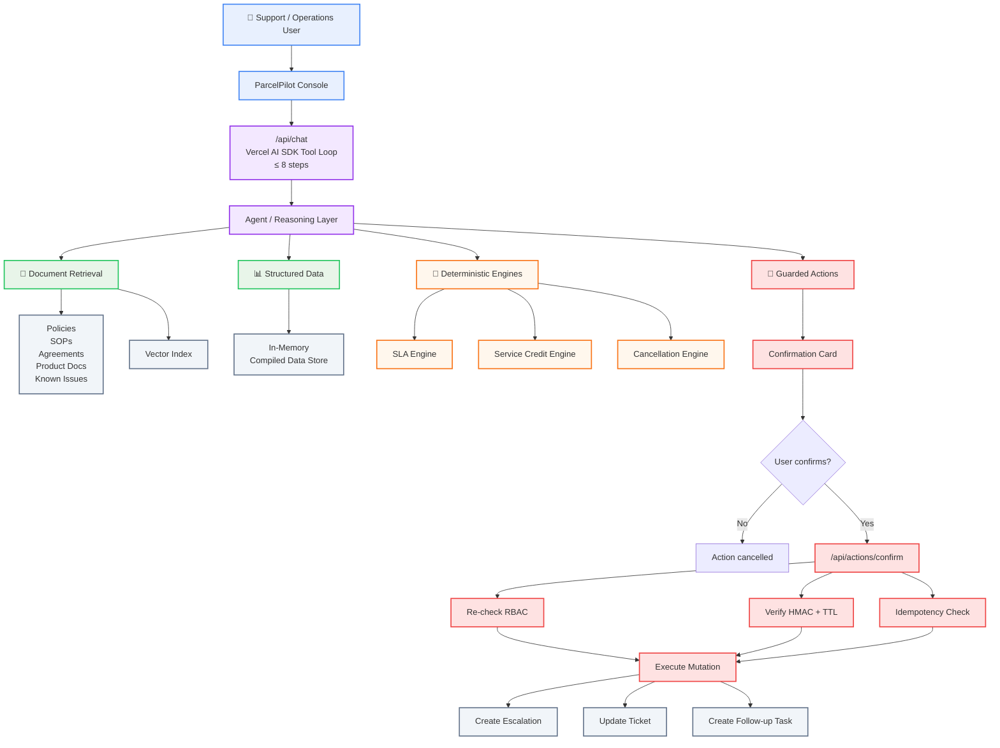

# ParcelPilot — Support & Operations Console

An internal AI support and operations console for ParcelPilot's support team, built for the **CalQuity AI Engineer — AI Agent Assessment**.

ParcelPilot combines source-aware retrieval, deterministic business logic, role-scoped tools, and human-confirmed state-changing actions.

The agent answers policy and operational questions using vector retrieval over the supplied document corpus, looks up structured order/ticket data, evaluates SLA and fee calculations through deterministic TypeScript engines, and executes mutations only after server-side authorization and an HMAC-signed, expiring confirmation step.

---

## Live Application

**Production:**
https://parcelpilot-ops-console.vercel.app/console

---

## What This Demonstrates

The implementation focuses on the parts of an AI agent that need to be reliable beyond simply generating an answer:

* Multi-step tool-using agent
* Retrieval over heterogeneous source documents
* Structured operational data lookup
* Deterministic SLA, cancellation, and service-credit calculations
* Role-based access control enforced at the tool/data layer
* Human confirmation before state-changing actions
* HMAC-signed, expiring action intents
* Idempotent mutation execution
* Source authority and conflict handling
* Proactive operational issue detection
* Visible tool execution traces in the UI

---

## Assessment Requirements

| CalQuity requirement                 | Implementation                                                                            |
| ------------------------------------ | ----------------------------------------------------------------------------------------- |
| Natural-language chatbot             | `/console` AI support and operations console                                              |
| Document retrieval                   | Vector retrieval over supplied policies, SOPs, agreements, product docs, and known issues |
| Structured-data lookup / calculation | Account, order, ticket lookup plus typed calculation engines                              |
| At least 3 agent tools               | Retrieval, structured lookup/calculation, and state-changing tools                        |
| State-changing action                | Escalations, ticket updates, and follow-up tasks                                          |
| Confirmation before mutation         | Signed confirmation card + explicit user confirmation                                     |
| Access control                       | Role-based capability checks inside tool execution and confirmation API                   |
| Multi-step requests                  | Vercel AI SDK tool loop supporting up to 8 steps                                          |
| Tool visibility                      | Tool calls are rendered as visible trace chips in the console                             |
| Proactive issue detection            | `/insights` detects SLA, known-issue, outage, and answer-conflict signals                 |
| Hosted application                   | Deployed on Vercel                                                                        |
| Architecture note                    | [`ARCHITECTURE.md`](ARCHITECTURE.md)                                                      |
| Product note                         | [`PRODUCT.md`](PRODUCT.md)                                                                |
| AI tooling disclosure                | Included at the end of this README                                                        |

---

## Architecture



### Request flow

A typical request can span several tools and data sources:

```text
User request
    ↓
Agent
    ↓
Identify required information
    ↓
Retrieve authoritative documents
    ↓
Look up account / order / ticket data
    ↓
Apply applicable contract + policy rules
    ↓
Run deterministic calculation if required
    ↓
Answer OR prepare a state-changing action
    ↓
Human confirmation
    ↓
Server-side authorization + HMAC verification
    ↓
Execute mutation
```

The agent is therefore not expected to solve every request from a single retrieval call or a single model response.

---

## Agent & Tool Design

The agent uses a Vercel AI SDK tool loop with a maximum of 8 steps.

### Read / compute tools

**`search_documents`**

Searches the supplied document corpus, including:

* Current support policy
* Deprecated support policy
* Cancellation and service-credit SOP
* Product operations guide
* Known issues
* Customer-specific agreements

**`get_order`**

Retrieves structured order information from the supplied dataset.

**`get_ticket`**

Retrieves structured support-ticket information.

**`calculate_cancellation`**

Determines applicable cancellation fees using deterministic business rules.

**`calculate_service_credit`**

Calculates applicable service credits using typed business logic.

**`check_sla`**

Evaluates SLA status and elapsed time against the applicable target.

### State-changing tools

**`create_escalation`**

Prepares an escalation for execution after confirmation.

**`update_ticket`**

Prepares a ticket update.

**`create_task`**

Prepares a follow-up task.

State-changing tools do not directly mutate state when initially called by the agent. They produce a signed, expiring confirmation intent that must be explicitly confirmed by the user.

---

## Multi-Step Reasoning

The system supports requests that require multiple sources and tools.

For example:

> "Can Northstar cancel ORD-1001 without a cancellation fee? Explain why."

The agent may need to:

```text
1. Identify the customer
        ↓
2. Look up ORD-1001
        ↓
3. Retrieve Northstar's agreement
        ↓
4. Retrieve the applicable cancellation SOP
        ↓
5. Determine source precedence
        ↓
6. Run cancellation calculation
        ↓
7. Explain the result
```

Another request could require:

```text
Order lookup
    +
Customer agreement
    +
Current policy
    +
SLA calculation
    +
Escalation decision
```

The implementation does not hard-code the example order IDs or answers.

---

## Trust & Reliability

ParcelPilot's source data is intentionally imperfect.

Some documents are outdated, customer-specific agreements can override general policies, and historical ticket resolutions may contain incorrect guidance.

The system therefore assigns different authority to different source types.

### Source precedence

The implementation follows this precedence:

```text
Customer-specific agreement
        ↓
Current support policy / applicable SOP
        ↓
Product & operations documentation
        ↓
Historical ticket resolutions
```

Historical ticket resolutions are treated as contextual evidence rather than authoritative policy.

### Why this matters

A retrieval system that simply returns the highest-scoring chunk can produce a confidently incorrect answer when an older policy or historical ticket conflicts with a current customer agreement.

ParcelPilot instead separates:

* Retrieval
* Source authority
* Business-rule evaluation
* Historical context

This allows the system to reason about conflicting information deliberately.

### Escalation

The agent should escalate rather than invent an answer when:

* Required information is unavailable
* The request requires unsupported human judgment
* Sources conflict without a resolvable precedence
* The requested operation is outside the user's capabilities
* The system cannot confidently determine the correct action

---

## Deterministic Business Logic

### No LLM arithmetic

Money and SLA calculations are not delegated to the language model.

The LLM identifies the relevant entities and invokes typed TypeScript engines.

The engines perform the actual calculation.

```text
Documents
    ↓
Boot-time PolicyModel parser
    ↓
Typed parameters
    ↓
Deterministic calculation engine
    ↓
Result
```

The main engines are:

* SLA calculation
* Cancellation calculation
* Service-credit calculation

This means a data-pack change can alter business behavior without requiring a code change to the calculation logic.

---

## Security Model

Authorization is enforced in the tool/data layer rather than relying on model instructions.

### Roles

The console provides three mock roles:

| Role          | Access                                    |
| ------------- | ----------------------------------------- |
| Analyst       | Read-only access                          |
| Support Agent | Support investigation + permitted actions |
| Ops Manager   | Broader operations capabilities           |

RBAC is checked inside tool execution and is re-checked before mutation execution.

### State-changing action flow

```text
Agent prepares action
        ↓
Signed confirmation intent
        ↓
User sees confirmation card
        ↓
User clicks Confirm
        ↓
POST /api/actions/confirm
        ↓
Re-check RBAC
        ↓
Verify HMAC-SHA256 signature
        ↓
Verify expiration / TTL
        ↓
Check idempotency
        ↓
Execute action
```

### Confirmation tokens

Intent tokens are:

* HMAC-SHA256 signed
* Expiring after 10 minutes
* Bound to the intended action
* Re-authorized server-side
* Protected by an idempotency check

This allows the write path to remain stateless and compatible with ephemeral serverless runtimes.

---

## Proactive Operations — `/insights`

The assessment also identifies a broader problem beyond reactive chatbot interactions: helping support and operations teams identify recurring, urgent, or unusual issues across their activity.

ParcelPilot includes an internal insights dashboard that performs a deterministic snapshot-time signal scan.

### Current signals

**SLA breach detection**

Identifies high-severity tickets approaching or exceeding contract-aware SLA targets.

**Known-issue correlation**

Clusters tickets against known product issues.

**Outage signals**

Looks for correlated support activity that may indicate a broader operational issue.

**Historical-answer audit**

Identifies historical ticket answers that contradict current authoritative sources.

The goal is to turn the system from a purely reactive chatbot into an operational surface that can help teams decide **what deserves attention next**.

---

## Chat Console

The `/console` interface provides:

* Natural-language interaction
* Role selection
* Retrieval and operational data access
* Visible tool execution traces
* Confirmation cards for mutations
* Action execution feedback

Every tool call renders a visible trace chip so the user can understand which capability the agent is using.

---

## Data & Retrieval

The supplied data pack is compiled into application-readable structures.

The system processes:

* Support policies
* Deprecated policies
* Cancellation / service-credit SOP
* Product operations documentation
* Known issues
* Customer agreements
* Structured account data
* Order data
* Ticket data

### Vector retrieval

Document chunks and relevant structured records are embedded into a local vector index.

For the current assessment-sized dataset, brute-force cosine similarity is sufficient.

The `Retriever` abstraction keeps the retrieval layer replaceable if the dataset grows substantially.

A managed vector database such as pgvector would become more appropriate at significantly larger scale.

---

## Data Handling & Policy Parsing

At startup, the application builds a typed policy model from the supplied source documents.

This allows business-rule parameters to be extracted from the data pack rather than hard-coded into individual calculations.

The data pipeline can be regenerated with:

```bash
npm run compile-data
```

and embeddings with:

```bash
npm run embed
```

---

## Insights vs. Chatbot

The two surfaces serve different operational purposes.

| Surface     | Purpose                                                |
| ----------- | ------------------------------------------------------ |
| `/console`  | Reactive investigation and question answering          |
| `/insights` | Proactive identification of issues requiring attention |

The chatbot answers:

> "What is happening with this customer/order/ticket?"

The insights surface helps answer:

> "What should the operations team investigate next?"

---

## Design Decisions

### 1. No LLM arithmetic

Business-critical calculations are performed by typed deterministic engines.

**Trade-off:** More implementation work, but predictable and testable results.

### 2. Contract > Policy precedence

Customer agreements override general policies when applicable.

**Trade-off:** Requires source classification and explicit precedence rather than treating retrieval scores as truth.

### 3. Historical tickets are context-only

Previous support answers can be wrong and therefore do not override authoritative current sources.

**Trade-off:** Historical data becomes less authoritative, but the system is less likely to perpetuate outdated guidance.

### 4. Stateless confirmation

HMAC-signed intents avoid requiring an external database solely for confirmation state.

**Trade-off:** The implementation is simpler and serverless-friendly, while the assessment's mocked write path does not require durable transactional state.

### 5. In-memory data store

The assessment dataset is small enough that an in-memory compiled store and brute-force vector search are sufficient.

**Trade-off:** Very simple deployment and low latency, but a larger production dataset would require persistent storage and a scalable retrieval layer.

### 6. Mocked authentication

The assessment allows authentication, account context, and roles to be mocked.

The implementation focuses on enforcing authorization boundaries correctly rather than building a complete identity provider.

---

## Project Structure

```text
src/
  app/
    api/
      actions/
        confirm/          HMAC intent execution
      auth/               Login / logout / session
      chat/               Streaming tool loop
      health/             Readiness + policy-parse status
    console/              Chat interface
    insights/             Proactive issue detection
    page.tsx              Role selector / landing

  components/
    thread.tsx            Assistant UI renderer + tool grouping
    ops-tool-fallback.tsx Tool trace chips + confirmation card
    ops-welcome.tsx       Starter prompts
    brand-badge.tsx       Header logo
    insights-view.tsx     Insights card layout

  lib/
    actions/              Intent tokens, store, executors
    agent/                System prompt, model config, tool catalogue
    auth/                 RBAC matrix + capability guards
    data/                 In-memory entity lookups
    engines/              SLA, credit, cancellation engines
    policy/               Boot-time PolicyModel parser
    retrieval/            Vector search + embedding provider

tests/
  policy.test.ts
  sla-math.test.ts
  rbac-intents.test.ts
  engines.test.ts
  retrieval.test.ts

ARCHITECTURE.md            Detailed architecture note
PRODUCT.md                 Product decisions, roadmap, metric
```

---

## Setup

### Requirements

* Node.js 20+
* npm 10+

### Install

```bash
git clone https://github.com/<your-username>/parcelpilot-ops-console.git
cd parcelpilot-ops-console
npm install
```

### Environment variables

Create `.env.local`:

```env
GROQ_API_KEY=gsk_...
GROQ_MODEL=qwen/qwen3.6-27b
GROQ_BASE_URL=https://api.groq.com/openai/v1

GOOGLE_API_KEY=AIza...
GEMINI_EMBED_MODEL=gemini-embedding-001

APP_SECRET=<random 32+ chars>
```

### Run locally

```bash
npm run dev
```

Application:

```text
http://localhost:3000
```

Health endpoint:

```text
GET /api/health
```

The health endpoint reports:

* LLM configuration
* Embedding provider
* Vector index status
* Policy parsing warnings

---

## Scripts

| Command                | Purpose                                                              |
| ---------------------- | -------------------------------------------------------------------- |
| `npm run compile-data` | Re-extract PDFs/XLSX from `../data` into `src/data/generated/*.json` |
| `npm run embed`        | Embed chunks, known issues, and tickets into `vectors.json`          |
| `npm run test`         | Run the test suite                                                   |
| `npm run typecheck`    | Run `tsc --noEmit`                                                   |
| `npm run lint`         | Run ESLint                                                           |
| `npm run build`        | Build the production application                                     |

---

## Tests

The project includes integration and unit coverage across the core reliability boundaries.

```text
tests/policy.test.ts
    11 tests — policy parsing

tests/sla-math.test.ts
    5 tests — SLA elapsed-time math

tests/rbac-intents.test.ts
    7 tests — RBAC matrix + HMAC tokens

tests/engines.test.ts
    19 tests — cancellation + service-credit engines

tests/retrieval.test.ts
    4 tests — cosine similarity math
```

**Current total: 46 tests, 0 failures.**

The tests focus particularly on deterministic behavior and security-sensitive boundaries rather than only testing the UI.

---

## API Surface

### `GET /api/health`

Reports application readiness and configuration status.

### `POST /api/chat`

Streams the agent interaction and tool execution through the Vercel AI SDK.

### `POST /api/actions/confirm`

Accepts a confirmed action intent and performs the final:

1. RBAC check
2. HMAC verification
3. Expiration check
4. Idempotency check
5. Mutation execution

---

## Limitations & Production Considerations

This submission intentionally keeps several components lightweight because the supplied assessment dataset is small and the write path is mocked.

For a production ParcelPilot deployment, I would replace or extend:

* Mock authentication → production identity provider
* In-memory entity store → persistent operational database
* Local vector index → managed vector database / pgvector
* Mock mutation store → transactional backend
* Cold-start action log → durable audit/event store
* Snapshot-time insights → continuously updated event pipeline
* Basic retrieval → hybrid retrieval + reranking
* Simple role model → production RBAC/ABAC with tenant isolation

The current abstractions are designed so these replacements do not require rewriting the agent layer.

---

## Further Product Development

The additional client problem addressed in this submission is **Proactive Issue Detection**.

If development continued, the highest-priority additions would be:

### 1. Durable audit trail

Persist every retrieval, answer, confirmation, and mutation for investigation and compliance.

### 2. Better source conflict UX

Expose why a particular source won when multiple authoritative-looking documents disagree.

### 3. Hybrid retrieval

Combine semantic retrieval with metadata, keyword, and structured filters.

### 4. Production event pipeline

Move proactive issue detection from snapshot-time analysis to continuously updated operational signals.

### 5. Evaluation harness

Build a regression set covering:

* Policy questions
* Contract overrides
* Historical contradictions
* SLA calculations
* Authorization boundaries
* Mutation confirmation
* Multi-step tool calls

### 6. Customer-facing context

Extend the same architecture to a customer-facing agent while enforcing strict tenant/account isolation.

---

## Product Metric

The primary metric I would use to judge usefulness is:

> **Resolution rate without human intervention, subject to correctness.**

A successful system should not simply maximize the number of automated answers.

The metric should measure how often the system resolves a request **correctly and safely**, without requiring a support employee to take over.

Secondary metrics would include:

* Escalation rate
* Tool-call success rate
* Retrieval accuracy
* Incorrect-answer rate
* Mutation confirmation rate
* Time-to-resolution
* Proactive issue detection precision

---

## AI Tool Usage

Development used **OpenCode and Antigravity AI** for:

* Initial project scaffolding
* Module implementation
* Test authoring
* Iterative development assistance

All generated implementation was reviewed and validated during development.

The AI coding tools were used as development assistants; the final architecture, security model, tool boundaries, deterministic calculation approach, source precedence rules, and product decisions were reviewed as part of the implementation.

---

## Documentation

### Architecture Note

See [`ARCHITECTURE.md`](ARCHITECTURE.md) for:

* Agent design
* Tool design
* Document and structured-data handling
* Source reliability and conflict handling
* Major technical trade-offs

### Product Note

See [`PRODUCT.md`](PRODUCT.md) for:

* Additional client problem
* Product direction
* Prioritised future work
* Intentional omissions
* Product metric

---

## Submission

**Live application:**
https://parcelpilot-ops-console.vercel.app/console

**Repository:**
https://github.com/<your-username>/parcelpilot-ops-console

**Architecture:** [`ARCHITECTURE.md`](ARCHITECTURE.md)

**Product:** [`PRODUCT.md`](PRODUCT.md)
